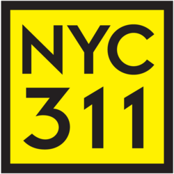

# Ross Lohrisch

I’m an engineer with a background in systems engineering, frontend development, and analytics, currently completing an M.S. in Analytics at Georgia Tech.

I’m interested in work that makes complex information easier to understand and use, especially when it involves data, dashboards, or operational systems.

## 🧭 What I work on

- analyzing operational and system-performance data
- building dashboards and visual summaries
- turning messy technical data into clear recommendations
- working across technical and operational teams

## 🛠️ Background

My experience includes systems engineering, performance analysis, frontend development, and working with technical data in complex environments.

## 🧰 Tools I use often

Python • SQL • R • Tableau • Git • MATLAB • Linux • CLI

## ✨ Featured Projects

### NYC 311 Data Quality Dashboard
An interactive Streamlit dashboard that turns NYC 311 service requests into a clean, readable project.

- GitHub: https://github.com/RossLohrisch/nyc-311-dashboard
- Live demo: https://nyc-311-dashboard-6agf3rq3kcnd3dhbnx2hwf.streamlit.app/

## Featured Project

<table>
  <tr>
    <td width="180">
      
    </td>
    <td>
      <h3>NYC 311 Data Quality Dashboard</h3>
      

        An interactive Streamlit dashboard that makes NYC 311 service requests easier to explore,
        understand, and trust.
      

      

        <a href="https://github.com/RossLohrisch/nyc-311-dashboard">GitHub Repo</a> ·
        <a href="https://nyc-311-dashboard-6agf3rq3kcnd3dhbnx2hwf.streamlit.app/">Live Demo</a>
      

    </td>
  </tr>
</table>
